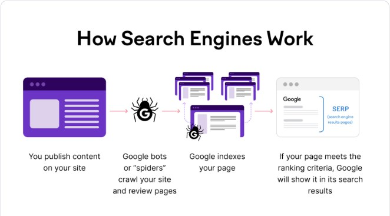
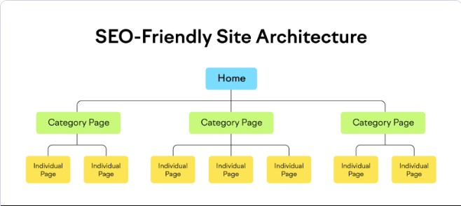
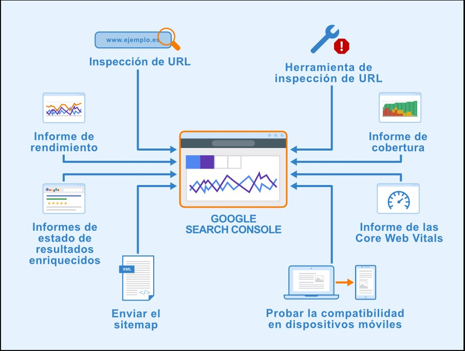

# SEO on-page

---

SEO **(Search Engine Optimization)** es el proceso de optimizar una página web para mejorar su visibilidad en los motores de búsqueda como Google, Bing, y otros. El objetivo principal del SEO es aumentar el tráfico orgánico hacia el sitio web, es decir, el número de visitantes que llegan a través de resultados de búsqueda no pagados. Aquí hay algunos aspectos clave del SEO:

La **indexación** de una página web es el proceso mediante el cual los motores de búsqueda, como Google, recopilan, analizan y almacenan información sobre las páginas web para que puedan ser recuperadas y mostradas en los resultados de búsqueda. Este proceso implica varias etapas:

El motor general de Google se conoce como **Google Search Engine.** Este es el núcleo del sistema de búsqueda de Google y está compuesto por varios componentes y tecnologías que trabajan juntos para rastrear, indexar y clasificar páginas web. Aunque el término más comúnmente utilizado para referirse a este motor de búsqueda es simplemente "Google," el nombre técnico de su tecnología subyacente es Google Search Engine.

**Google Search Engine** incluye varios componentes y tecnologías clave:

**Googlebot:** El robot de rastreo que recorre la web para encontrar y recopilar información sobre páginas web.

**Indexing System:** El sistema que organiza y almacena la información recopilada por Googlebot para que pueda ser recuperada rápidamente durante una búsqueda.

**Ranking Algorithms:** Algoritmos complejos que determinan el orden en que se presentan los resultados de búsqueda basándose en numerosos factores como relevancia, calidad del contenido, autoridad de la página, entre otros.

**Knowledge Graph:** Una base de datos de información interconectada que permite a Google proporcionar respuestas directas a preguntas y mostrar información contextual.

**Machine Learning and AI:** Tecnologías de aprendizaje automático e inteligencia artificial que mejoran la precisión y relevancia de los resultados de búsqueda.
Estos componentes trabajan en conjunto para proporcionar la experiencia de búsqueda eficiente y precisa que los usuarios asocian con Google.

Las **metaetiquetas** (o meta tags) son etiquetas HTML que se colocan en la sección **head** de un documento HTML. No son visibles para los usuarios que visitan la página web, pero proporcionan información importante a los motores de búsqueda, navegadores web y otros servicios sobre la página web. Las metaetiquetas pueden influir en el SEO (Search Engine Optimization), el comportamiento del navegador y la forma en que se muestra el contenido.

1. **meta description (Meta descripciones)**

```HTML
<meta name="description" content="Parrafo">

```

La metaetiqueta de descripción de una página, ofrece a Google y a otros buscadores un resumen del contenido de la misma. Puede contener una frase o dos, o incluso un párrafo breve.

2. **keywords (palabras claves)**

```HTML
 <head>
   <meta name="description" content="Ejemplo de Palabras Clave y Programación">
   <meta name="keywords"  content="HTML, ASP, JS, META, PALABRAS CLAVE, EJEMPLO">
</head>

```

3. **Author**

```HTML
<meta name="author" content="Nombre del Autor">

```

4. **títulos de páginas**

```HTML
<title>Título de mi página</title>

```

5. **robots**
   Controla cómo los motores de búsqueda indexan y siguen los enlaces en la página.

```HTML
<meta name="robots" content="index, follow">
<!-- Opciones: noindex, nofollow, noarchive, nosnippet, etc. -->

```

Una etiqueta title indica tanto a los usuarios como a los motores de búsqueda el tema sobre el que trata una página.

Lo ideal sería crear un título único para cada página del sitio.

El título de tu página principal puede incluir el nombre de tu sitio web o negocio, y podría incluir otra información importante.

5. **jerarquía de encabezados**

Al utilizar varios tamaños de encabezado en orden (h1, h2, h3, etc), se crea una estructura jerárquica de contenido, lo que permite a los usuarios navegar por un documento con más facilidad.
Considera cuáles son los puntos principales y secundarios del contenido de la página y, en función de ello, decide dónde utilizar etiquetas de encabezado.

6. **contenido textual del sitio**

### Open Graph (Facebook, LinkedIn, Twitter, Pinterest, WhatsApp)

```HTML
<meta property="og:title" content="Título de la Página">

```

Define el título de la página cuando se comparte en redes sociales.

```HTML
<meta property="og:description" content="Descripción de la Página para Redes Sociales">

```

Proporciona una descripción breve de la página para mostrar en redes sociales.

```HTML
<meta property="og:image" content="https://www.ejemplo.com/imagen.jpg">

```

Especifica una imagen que se utilizará cuando la página se comparta en redes sociales.

```HTML
<meta property="og:url" content="https://www.ejemplo.com/pagina">

```

Descripción: Define la URL canónica de la página.

```HTML
<meta property="og:type" content="website">

```

Especifica el tipo de objeto Open Graph. Los valores comunes incluyen website, article, video.movie,

```HTML
<meta property="og:site_name" content="Nombre del Sitio">

```

Indica el nombre del sitio web.

```HTML
<meta property="og:locale" content="es_ES">

```

### Ejemplo completo

```HTML
<!DOCTYPE html>
<html lang="es">
<head>
  <meta charset="UTF-8">
  <meta name="viewport" content="width=device-width, initial-scale=1.0">
  <title>Ejemplo de Página</title>

  <!-- Metaetiquetas Open Graph -->
  <meta property="og:title" content="Ejemplo de Título">
  <meta property="og:description" content="Esta es una descripción de ejemplo para la página.">
  <meta property="og:image" content="https://www.ejemplo.com/imagen.jpg">
  <meta property="og:url" content="https://www.ejemplo.com/pagina">
  <meta property="og:type" content="website">
  <meta property="og:site_name" content="Nombre del Sitio">
  <meta property="og:locale" content="es_ES">

  <!-- Metaetiquetas Twitter (Opcional pero recomendable) -->
  <meta name="twitter:card" content="summary_large_image">
  <meta name="twitter:title" content="Ejemplo de Título">
  <meta name="twitter:description" content="Esta es una descripción de ejemplo para la página.">
  <meta name="twitter:image" content="https://www.ejemplo.com/imagen.jpg">
  <meta name="twitter:site" content="@nombredeusuario">
</head>
<body>
  <h1>Contenido de la Página</h1>
</body>
</html>

```

Especifica el idioma del contenido.

### **`Tips generales`**

- A los usuarios les gusta el contenido bien escrito y fácil de entender.
- Te recomendamos que organices el contenido para que los usuarios sepan dónde termina un tema y empieza otro, creando una especie de historia.
- Al dividir el contenido en secciones o bloques lógicos, los usuarios pueden encontrar lo que buscan más rápidamente.

- Diseña tu sitio web teniendo en cuenta las necesidades de los visitantes y, a la vez, asegúrate de que los buscadores puedan acceder a él fácilmente.

- Para crear contenido de alta calidad, se necesita gran cantidad de al menos uno de estos factores: tiempo, dedicación, experiencia y talento.

- El contenido debe ofrecer información precisa, estar redactado de manera clara y ser exhaustivo.

# SEO off-page

---

El **SEO Off-Page** se refiere a las optimizaciones que se pueden realizar en otros sitios web para ayudar a mejorar un sitio web diferente. Entre las estrategias podemos encontrar:

1. - Promoción y señales en redes sociales.

   - Enlaces en otros sitios web relacionados.

   - Evitar promocionar todas las novedades pequeñas , promocionar solo las novedades mas importantes e interesantes.

2. Enviar solicitudes a todos los sitios web cuyo contenido esté relacionado con tu área temática para que incluyan enlaces a tu sitio web.

# SEO técnico

---

El SEO Técnico se refiere a las optimizaciones que ayudan a los buscadores a rastrear e indexar las páginas web de

Algunas tácticas a aplicar son:

Mejorar la velocidad de carga de la página
(por ejemplo, optimizando las imágenes, algo que veremos más adelante)



- Publicamos contenido en nuestro sitio.
- Las botas o "arañas" de Google rastrean su sitio y revisan las páginas
- google indexa tus páginas
- Si su página cumple con los criterios de clasificación, Google la mostrará en sus resultados de búsqueda.

### **1.`Organizar la jerarquía de archivos.`**



- Los buscadores necesitan una URL única por fragmento de contenido para poder rastrear e indexar dicho contenido. Deben utilizar URL diferentes para que aparezcan correctamente en la búsqueda.
- Las URL se dividen generalmente en varias secciones distintas:
  **protocolo://nombredehost/ruta/nombredearchivo?cadenadeconsulta#fragmento**

  - `Protocolo (protocolo):` Por lo general, es http o https, pero algunos sitios pueden usar otros protocolos como ftp o mailto.

  - `Nombre de host (nombredehost):` Este es el dominio principal del sitio web, como www.ejemplo.com o subdominio.ejemplo.com.

  - `Ruta (ruta):` Especifica la ubicación dentro del sitio web. Puede ser una carpeta o un directorio, como /productos o simplemente /.

  - `Nombre de archivo (nombredearchivo):` Es el recurso específico al que se accede. Algunos sitios lo incluyen explícitamente (archivo.html), mientras que otros lo omiten.

  - `Cadena de consulta (cadenadeconsulta):` Contiene parámetros adicionales que pueden influir en cómo se muestra la página. No todas las páginas necesitan una cadena de consulta.

  - `Fragmento (fragmento):` Usado para identificar una sección específica dentro de la página. No todas las páginas necesitan un fragmento.

### `Ejemplo youtube (buscando algo)`

---

**`Protocolo: https`**

Indica que la comunicación se realiza a través del protocolo seguro HTTPS.

**`Nombre de host`:** www.youtube.com

Es el dominio principal de YouTube donde se encuentra alojado el servicio de videos.

**`Ruta: /results`**

Indica que la solicitud está accediendo a la página de resultados de búsqueda en YouTube.

**`Nombre de archivo`:** No hay un archivo específico mencionado en esta URL.

En YouTube, la ruta /results generalmente maneja la presentación de resultados de búsqueda dinámicos.

**`Cadena de consulta`:** ?search_query=jazz

Contiene parámetros que se utilizan para enviar datos adicionales al servidor. En este caso, **search_query=jazz** indica que se está realizando una búsqueda de videos con el término "jazz".

**search_query** es el parámetro utilizado por YouTube para especificar el término de búsqueda.

**jazz** es el término de búsqueda específico que se está buscando.

**`Fragmento:`**
No hay fragmento (#) en esta URL.

### `Yendo a un video puntual`

---

Protocolo: https
Indica que la comunicación se realiza a través del protocolo seguro HTTPS.

**`Nombre de host:`** www.youtube.com
Es el dominio principal de YouTube donde se encuentra alojado el servicio de videos.

**`Ruta:`** /watch
Indica que la solicitud está accediendo a la página de visualización de un video específico en YouTube.

**`Nombre de archivo:`** No hay un archivo específico mencionado en esta URL.
En YouTube, la ruta /watch maneja la presentación de videos individuales identificados por su ID único.

**`Cadena de consulta:`**

**`v=LELQLEDnDvg:`** Es un parámetro que identifica el ID único del video específico que se está visualizando en YouTube. En este caso, el video con ID LELQLEDnDvg.

**`list=RDCLAK5uy_nm4NA8cldZNPqj1D0ayZxfySeY89qedRs:`** Es un parámetro que indica que este video pertenece a una lista de reproducción específica en YouTube.

El ID de la lista de reproducción es
**RDCLAK5uy_nm4NA8cldZNPqj1D0ayZxfySeY89qedRs**.

**`start_radio=1:`** Es un parámetro que indica que el modo de radio debe activarse después de que finalice este video.

**`Fragmento:`** No hay fragmento (#) en esta URL.

### **2. `La navegación es importante para los usuarios`**

- Ayuda a los visitantes a encontrar rápidamente el contenido que buscan.

- Contribuye a que los buscadores comprendan qué contenido considera importante el webmaster.

- Aunque los resultados de búsqueda de Google muestran información a nivel de página, a Google también le gusta saber, en términos generales, qué función tiene una página en el conjunto del sitio web.

### **3.`Qué es un breadcrumb`**

- Una ruta de exploración (también llamada breadcrumb) es una fila de enlaces internos, situada en la parte superior o inferior de una página, que permite a los visitantes volver rápidamente a una sección anterior, o a la página de inicio.

### **4.` Planifica la navegación a partir de la pagina principal`**

- Todos los sitios web tienen una página principal o de inicio, que suele ser la página más visitada y el punto de partida de navegación.

- Debes pensar en cómo los visitantes van a ir de la página principal (de inicio), a una página con contenido más específico.

### 5.**`Crear un mapa de sitio (Sitemap)`**

Los rastreadores de los motores de búsqueda visitan las páginas web, analizan su contenido y enlaces, e indexan la información en bases de datos en función de su relevancia.

Cuando los usuarios realizan una búsqueda, el motor recupera las páginas relevantes de su índice para mostrar los resultados.

- Un mapa de sitio es una página sencilla de un sitio web que muestra su estructura, y normalmente consiste en una lista jerárquica de las páginas que se incluyen en este.

- Es posible que los visitantes la consulten si no pueden encontrar algunas páginas del sitio web. Los buscadores también la visitan.

- Crea una página de navegación para los usuarios y un sitemap para los buscadores.
  Para aprovechar los buscadores, crea un archivo de sitemap en formato XML que incluya todas las URL relevantes del sitio web. De este modo, los buscadores descubrirán las páginas. Utiliza **XML sitemaps**

- Utiliza un generador de sitemap online: los generadores de sitemaps como **Dupli Checker** o **XML Sitemaps Generator** crearán automáticamente un sitemap XML. También te permite identificar enlaces rotos para ayudar a mejorar la calidad del sitio y el proceso de rastreo.

### Ejemplo de sitemap generado por XML sitemap generator.

```XML
<?xml version="1.0" encoding="UTF-8"?>
<urlset
      xmlns="http://www.sitemaps.org/schemas/sitemap/0.9"
      xmlns:xsi="http://www.w3.org/2001/XMLSchema-instance"
      xsi:schemaLocation="http://www.sitemaps.org/schemas/sitemap/0.9
            http://www.sitemaps.org/schemas/sitemap/0.9/sitemap.xsd">
<!-- created with Free Online Sitemap Generator www.xml-sitemaps.com -->


<url>
  <loc>https://fernandomoyano2121.github.io/Seo_buenasPracticas/</loc>
  <lastmod>2024-07-01T20:10:50+00:00</lastmod>
  <priority>1.00</priority>
</url>
<url>
  <loc>https://fernandomoyano2121.github.io/Seo_buenasPracticas/index.html</loc>
  <lastmod>2024-07-01T20:10:50+00:00</lastmod>
  <priority>0.80</priority>
</url>
<url>
  <loc>https://fernandomoyano2121.github.io/Seo_buenasPracticas/pages/nosotros.html</loc>
  <lastmod>2024-07-01T20:10:50+00:00</lastmod>
  <priority>0.80</priority>
</url>
<url>
  <loc>https://fernandomoyano2121.github.io/Seo_buenasPracticas/pages/servicios/servicios.html</loc>
  <lastmod>2024-07-01T20:10:50+00:00</lastmod>
  <priority>0.80</priority>
</url>
<url>
  <loc>https://fernandomoyano2121.github.io/Seo_buenasPracticas/pages/productos.html</loc>
  <lastmod>2024-07-01T20:10:50+00:00</lastmod>
  <priority>0.80</priority>
</url>
<url>
  <loc>https://fernandomoyano2121.github.io/Seo_buenasPracticas/pages/contacto.html</loc>
  <lastmod>2024-07-01T20:10:50+00:00</lastmod>
  <priority>0.80</priority>
</url>
<url>
  <loc>https://fernandomoyano2121.github.io/Seo_buenasPracticas/pages/servicios/consultoria.html</loc>
  <lastmod>2024-07-01T20:10:50+00:00</lastmod>
  <priority>0.64</priority>
</url>
<url>
  <loc>https://fernandomoyano2121.github.io/Seo_buenasPracticas/pages/servicios/capacitaci%C3%B3n.html</loc>
  <lastmod>2024-07-01T20:10:50+00:00</lastmod>
  <priority>0.64</priority>
</url>
</urlset>

```

- **Listado de URLs:** Cada **url** dentro del **urlset** representa una página específica del sitio web, acompañada de detalles como la URL (<loc>), la última fecha de modificación (<lastmod>), y la prioridad (<priority>).

### **6.`Optimización movil`**

- Diseño web adaptable (método recomendado y es el que vimos como “diseño responsivo”).
- Publicación dinámica.
- URL independientes.

### Robot.txt

Especificacion de como queremeos que actuen los robots en nuestra web

```txt
User-agent: *
Disallow: /Clase_15_SEO_y_buenas Prácticas/Clase_15_SEO.md
Disallow: /Clase_15_SEO_y_buenas Prácticas/css/
Disallow: /Clase_15_SEO_y_buenas Prácticas/img/
Disallow: /Clase_15_SEO_y_buenas Prácticas/pages/contacto.html
Disallow: /Clase_15_SEO_y_buenas Prácticas/pages/nosotros.html
Disallow: /Clase_15_SEO_y_buenas Prácticas/pages/productos.html
Disallow: /Clase_15_SEO_y_buenas Prácticas/pages/servicios/
Disallow: /Clase_15_SEO_y_buenas Prácticas/pages/terminos.html
Disallow: /Clase_15_SEO_y_buenas Prácticas/sitemap.xml

```

### Explicación

**User-agent:**
Esta directiva especifica a qué agente de usuario (robot o crawler) se aplican las reglas que siguen. El \* se utiliza como comodín para indicar que las reglas se aplican a todos los robots.

**Disallow:**
Esta directiva indica a los robots qué partes del sitio web no deben ser indexadas. Puedes especificar directorios o archivos que no deseas que aparezcan en los resultados de búsqueda.

**Allow**
Esta directiva se utiliza para permitir a los robots acceder a partes específicas de tu sitio que de otro modo estarían bloqueadas por una regla de Disallow. Sin embargo, Allow no es parte del estándar original de robots.txt y no es ampliamente soportado por todos los robots.

# SEO local

---

Añadir un perfil de empresa de Google My Business.

Crear contenido que sea relevante para una ubicación específica.

### **1.`Que es Google My Businnes?`**

- Google My Business (o GMB) es un servicio de listados de empresas locales impulsado por Google. Su uso es completamente gratuito y el único requisito para utilizarlo es que el negocio tenga alguna forma de interacción cara a cara con los clientes.
- Google permite reclamar un panel de información del negocio y darlo a conocer. De esta forma, cuando la gente busque algo que el negocio provee, el sitio web aparecerá en sus resultados de búsqueda.
- Se pueden listar los servicios ofrecidos, agregar una sección de preguntas frecuentes, algunas fotos y también permitir que los clientes dejen comentarios sobre el negocio.

### **2.`Analizando el rendimiento de búsqueda`**

Los motores de búsqueda principales, incluido Google, proporcionan herramientas gratuitas con las que los webmasters pueden analizar el rendimiento de su sitio web en el motor de búsqueda que decidan. En el caso de Google, se trata de **Search Console**.

**Search Console** da respuesta a dos preguntas importantes:

- ¿Puede Google encontrar mi contenido?
- ¿Qué rendimiento tiene mi sitio web en los resultados de la Búsqueda de Google?




### **3.`Herramientas recomendadas para SEO`**

- **Wordtracker Scout** - Extensión de Chrome: Con esta herramienta podemos ver que usan nuestros competidores para mejorar su SEO.
- **Keyword Shitter:** Nos permite generar keywords útiles para nuestra web según el tema que se vende.
- **Seoquake:** Permite revisar todos los parámetros de SEO utilizados por una web.
- **SEO Minion - Extensión de Chrome:** Permite verificar la optimización SEO de una página web, los enlaces rotos, las vistas previas de SERP y cuenta con una simulación y comparación de SERP internacional.
